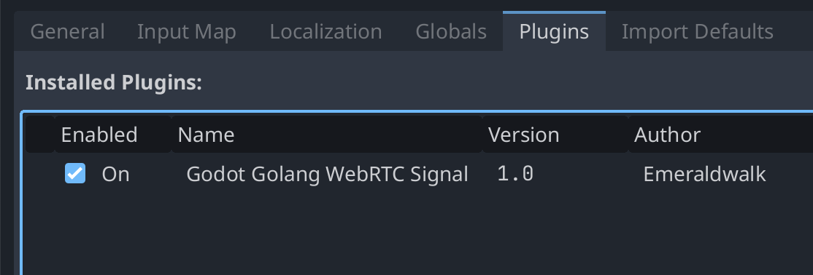
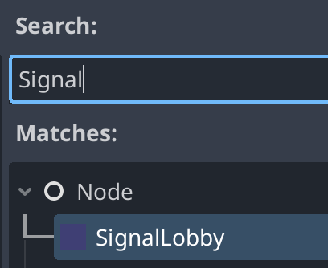

# Golang WebRTC Signaling Server

WebRTC signal server with SSL support written in Go. Supports hosting and joining lobbies. Includes Godot client. I built this to allow WebRTC connections from web builds in Godot which requires SSL. It also works with other build types.

> Note: Non-web builds require installing additional WebRTC libraries. See [webrtc.html#using-webrtc-in-godot ](https://docs.godotengine.org/en/stable/tutorials/networking/webrtc.html#using-webrtc-in-godot)

> Note: Currently, it is assumed this will be run somewhere on your LAN and that IPs can be resolved locally. I may extend this in the future for WAN usage.

## Project Architecture

- /client (`SignalWsClient` class) - Godot client code. Provides a `SignalLobby` node via a Godot plugin.
  - `SignalLobby` node (signal_lobby_node.gd and signal_lobby_node.tscn) - Handles signals from `SignalWsClient` class and creates a WebRTC mesh using Godot's multiplayer apis
  - `SignalWsClient` class (scripts/client.gd) - manages the client websocket connection and a `SignalWsPeer` instance
  - `SignalWsMsg` class (scripts/msg.gd) - defines message types and handles serialization / deserialization of messages.
  - `SignalWsPeer` class (scripts/peer.gd) -
- /server - Golang signaling server

### Messages

The server and client communicate over a websocket connection to establish a peer to peer WebRTC connection. Messages are identified by a numeric enum type:

```gdscript
enum Type {
	INVALID = 0,
	CONNECTED,
	HOST,
	JOIN,
	PEER_CONNECT,
	PEER_DISCONNECT,
	OFFER,
	ANSWER,
	CANDIDATE,
	SEAL
}
```

Messages are passing in a simple serialized format in the form of `type|pid|data`:

- type - numeric string for the msg type
- pid - peer id identifiying a peer in the WebRTC mesh
- data - optional data used by some message type

## Client

The client code can be installed as a Godot plugin

1. Copy the `/client` folder to the `/addons` folder in a Godot project
1. Enable the `Godot Golang WebRTC Signal` plugin in the Plugins tab of Project settings

   

1. The plugin provides a `SignalLobby` node that can be added to a scene

   

1. After adding the node to a scene, you can right-click on the node and select `% Access as Unique Name`. The node should now show a `%` character.

   

1. You can now connect to the `player_added` and `lobby_sealed` signals:

   ```gdscript
   @onready var signal_lobby = %SignalLobby # SignalLobby node set to "% Access as Unique Name"

   func _ready() -> void:
      signal_lobby.player_added.connect(_on_player_added)
      signal_lobby.lobby_sealed.connect(_on_lobby_sealed)
   ```

## Server

### Running Locally

In the `/server` directory, you can start the server by running:

```sh
go run cmd/main.go
```

To use an SSL cert, you'll need to place a `.crt` and `.key` file in the `/server` directory with the same base name.
e.g. `ssl.crt` and `ssl.key`

Then use the `-cert` flag to provide the cert base name.

```sh
go run cmd/main.go -cert ssl
```

### Deployment

1. To build the server run:

```sh
scripts/build.sh
```

1. This will build an executable `build/signalserver`
1. Copy the executable to wherever you want to run it

To use an SSL cert, you'll need to place a `.crt` and `.key` file in the same directory as the executable with the same base name.
e.g. `ssl.crt` and `ssl.key`

Then use the `-cert` flag to provide the cert base name.

```sh
./signalserver -cert ssl
```

#### Systemd Config

The server can be configured via systemd on a linux server such as a Raspberry Pi.

1. Open a new config file for the service:

   ```sh
   sudo nano /etc/systemd/system/gowebrtcsignal.service
   ```

1. Copy / paste the following template filling in <USER> and <APPDIR> placeholders

   ```ini
   [Unit]
   Description = Go WebRTC Signaling Server

   [Service]
   Type             = simple
   Restart          = always
   RestartSec       = 5s
   StandardOutput   = append:<APPDIR>/stdout.log
   StandardError    = append:<APPDIR>/stderr.log
   ExecStart        = <APPDIR>/signalserver
   WorkingDirectory = <APPDIR>
   User             = <USER>

   [Install]
   WantedBy = multi-user.target
   ```

1. Enable and start the service

```sh
sudo systemctl enable gowebrtcsignal.service
sudo systemctl start gowebrtcsignal.service
sudo systemctl status gowebrtcsignal.service
```
